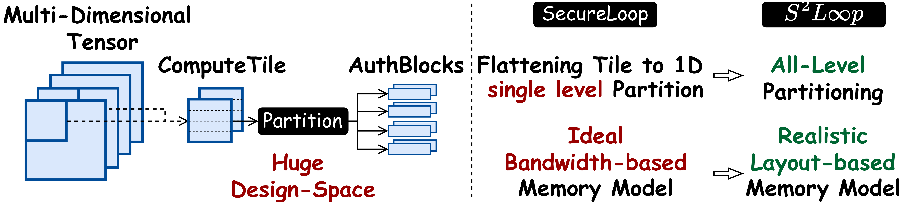

# SquareLoop

## About

SquareLoop is a tool based on [TimeLoop](https://timeloop.csail.mit.edu/) and its two derivatives: LayoutLoop and [SecureLoop](https://github.com/kyungmi-lee/SecureLoop-MICRO2023Artifact). It integrates the functionalities of both those tools: more accurate layout-based memory modeling and cryptographic overhead, and improves on both of them.

The key contributions of SquareLoop over previous tools are:
* flexible, all-level partitioning based AuthBlock
* realistic layout-based memory model utilizing accurate dataspace-wise evaluation
* introduction of physical ranks, allowing for independent per-dataspace layout and AuthBlock specification 
* Authentication-Layout-Mapping co-search algorithm

## Usage

It is recommended to clone this repository inside the docker available [here](https://github.com/Accelergy-Project/accelergy-timeloop-infrastructure/tree/master), which has all required packages for building squareloop.
Running the experiments will require installing the following python packages in a virtual environment:

`pip install torch torchlens pyyaml torchvision pandas`

To build SquareLoop use the `scons` command in the root directory of the repository.

SquareLoop interface is based on that of TimeLoop with some additions.
Use `build/timeloop-model` to evaluate a workload on a given architecture provided a mapping.
In order to enable layout-based memory modeling include a layout file in the command. Example layouts can be found in the experiment results.
To also anable cryptographic overhead evaluation include a cryptographic engine file, for example `benchmarks/crypto/AES-GCM-parallel.yaml`, and include `authblok_lines` section in the layout.

`build/timeloop-mapper` with provided layout will search for the best mapping using that layout. If layout is not provided the algorithm will co-search the mapping and layout (and AuthBlock if crypto is included).

There are several controllable knobs to tweak the behavior of both evaluation and search. They can be modified by including an optional knob file in the command,
for example `benchmarks/knob/knob.yaml`. If the knob file is not included the knobs will take their default values. The knobs available are:
* zero_padding (default: true) - include zero padding in the input tensor
* row_buffer (default: true) - include a row buffer in off-chip memory
* warmup (default: true) - include the warmup time of fetching the first tile (which cannot be pipelined with compute)

## Code Structure

Most changes introduced by SquareLoop are to the following files:

* `src/model/buffer.cpp` -
    This file contains the code for layout and AuthBlock modeling. The entrypoint for that evaluation is in the function `BufferLevel::ComputeBankConflictSlowdown`, which calculates a slowdown caused by memory and cryptography for a given memory level.

* `src/layoutspaces/layoutspace.cpp` -
    This file contains the code that creates the design space of layouts and AuthBlocks used in the Authentication-Layout-Mapping co-search algorithm.

* `src/applications/mapper/mapper-thread.cpp` -
    This file extends the mapping search by exploration of the layout and AuthBlock design space created in `layoutspace.cpp`.

## Experiment setup

We use the following files in the experiments:

* Architecture
    * SIGMA (vector256)
        * `benchmarks/arch_designs/vector_256.yaml`
    * Edge-TPU (systolic)
        * `benchmarks/arch_designs/vector_256.yaml`
        * `benchmarks/arch_designs/systolic_constraint/mapspace_XY_OS.yaml`
        * `benchmarks/arch_designs/systolic_constraint_depthwise/mapspace_XY_OS.yaml`
    * Eyeriss (eyeriss)
        * `benchmarks/arch_designs/eyeriss_like/arch/eyeriss_like.yaml`
        * `benchmarks/arch_designs/eyeriss_like/arch/components/*`
        * `benchmarks/arch_designs/eyeriss_like/constraints/*`
        * `benchmarks/arch_designs/eyeriss_like/constraints_depthwise/*`
* Workloads
    * ResNet18
        * `benchmarks/layer_shapes/resnet18/*`
    * MobileNetV3
        * `benchmarks/layer_shapes/mobv3/*`
* Mapper
    * `benchmarks/mapper/mapper_squareloop.yaml`
* Cryptographic engine
    * `benchmarks/crypto/AES-GCM-parallel.yaml`

Additionally `benchmarks/rtl-validation/` contains the experiment setup for the RTL validation experiment.

## Running experiments

Before running the experiments adjust `squareloop_dir` in `experiments/scripts/utils.py` to contain the path (`squareloop_dir`) to the squareloop repository. (Note: Some runs might produce slightly different results due to the restrictive mapper used. Rerunning the experiment should help reproduce the original result).

### Single Layer (Fig. 10)

Run `python3 experiments/scripts/run_LayerwiseCosearch.py` to fill `experiments/results/LayerwiseCosearch/` with results.
Then use `python3 experiments/scripts/plot_LayerwiseCosearch.py` to generate the plot in `experiments/results/LayerwiseCosearch/layerwise_cosearch.pdf`.

Note: this only runs for ResNet18 under Eyeriss as this is the test case for in-house accelerator (Golden Result), so that we could make apple-to-apple comparison with SecureLoop.

### Interlayer search (Fig. 11)

First run `python3 experiments/scripts/run_InterlayerInitialSearch.py` to find the single layer optimal layouts and fill results in `experiments/results/InterlayerInitialSearch/`.
Next, run `python3 experiments/scripts/run_Interlayer.py` to execute the layout constraint search and fill results in `experiments/results/Interlayer/`.
Lastly, use `python3 experiments/scripts/plot_Interlayer.py` to draw the plots in respective folders in `experiments/results/Interlayer/` and print the wall clock times of the constraint search.
The wall clock times for single layer search can be derived from summing wall times of all layers for a respective (architecture, model) combination in `experiments/results/InterlayerInitialSearch/stats.csv`.

Note: one could change `archs` and/or `models` in either `run_InterlayerInitialSearch.py` or `run_Interlayer.py` to only run the experiment for a subset of architectures and models.

### Number of engines (Fig. 12a)

Run `python3 experiments/scripts/run_NumberEngines.py` to fill `experiments/results/NumberEngines/` with results.
Then use `python3 experiments/scripts/plot_NumberEngines.py` to generate the plot in `experiments/results/NumberEngines/NumberEngines.pdf`.

Note:  one could change `num_engines_options` and/or `shared_options` in the `run_NumberEngines.py` to study the impact of different value of `num_engines` and using engines shared between dataspaces on the overall performance.  
Additionally, changing `arch`, `model` and `layer` in that same file will help run the experiment for a different architecture and workload. 
Changing `num_engines` in `plot_NumberEngines.py` will plot a different subset of `num_engines` values for which the experiment was performed.

### RTL validation (Fig. 12b)

Run `python3 experiments/scripts/run_RTLValidation.py` to print the results for SquareLoop.
Then use `python3 experiments/scripts/plot_RTLValidation.py` to generate the plot in `experiments/results/RTLValidation/RTLValidation.pdf` (note: the latencies are hardcoded in the `plot_RTLValidation.py` script and need to be manually adjusted).

Enjoy! XD
